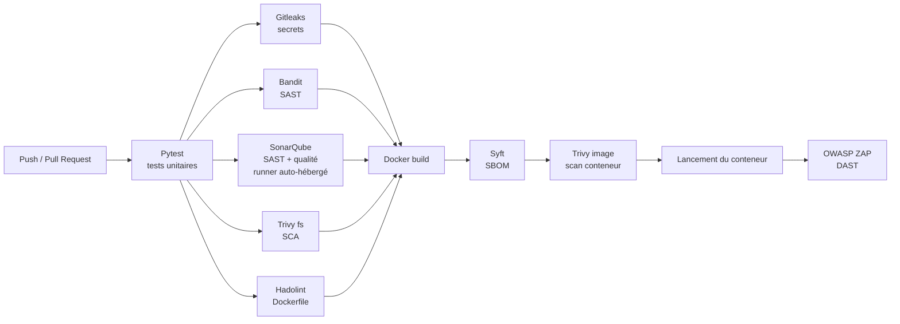
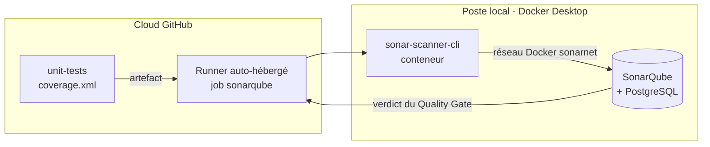

# 2. Architecture du pipeline

Le pipeline est défini dans [`.github/workflows/devsecops.yml`](../../.github/workflows/devsecops.yml)
et se déclenche à chaque `push` sur `main` et à chaque Pull Request.

## 2.1 Vue d'ensemble

## 2.2 Étapes

| Ordre | Job GitHub Actions | Outil | Type | Seuil bloquant |
|---|---|---|---|---|
| 1 | `unit-tests` | Pytest | Tests | Un test en échec |
| 2 | `secrets-scan` | Gitleaks | Secrets | Tout secret détecté |
| 2 | `sast` | Bandit | SAST | Sévérité MEDIUM ou plus (`-ll`) |
| 2 | `sonarqube` | SonarQube | SAST + qualité | Quality Gate « DevSecOps » en échec |
| 2 | `sca` | Trivy fs | SCA | CVE HIGH/CRITICAL corrigeable |
| 2 | `dockerfile-lint` | Hadolint | Lint IaC | Niveau `warning` ou plus |
| 3 | `build-scan-dast` | Syft | SBOM | Non bloquant (génère un artefact) |
| 3 | `build-scan-dast` | Trivy image | Scan conteneur | CVE HIGH/CRITICAL corrigeable |
| 3 | `build-scan-dast` | OWASP ZAP | DAST | Règles 10020, 10021, 10038 en `FAIL` |

## 2.3 Choix d'architecture

- **Les tests unitaires passent en premier.** Inutile de scanner un code qui ne
  fonctionne pas ; c'est aussi l'étape la plus rapide.
- **Les analyses statiques tournent en parallèle** (jobs 2), ce qui réduit la durée
  totale du pipeline.
- **L'image n'est construite que si toutes les analyses statiques sont vertes**
  (`needs: [secrets-scan, sast, sca, dockerfile-lint]`). On évite ainsi de produire
  un artefact dont on sait déjà qu'il est vulnérable.
- **Le DAST s'exécute sur l'image réelle** : le conteneur est lancé avec une
  `SECRET_KEY` générée aléatoirement (`openssl rand -hex 32`) puis ZAP l'attaque
  sur `http://localhost:5000`.
- **Chaque outil publie son rapport en artefact** (`actions/upload-artifact`), y compris
  en cas d'échec (`if: always()`), pour permettre l'analyse.
- **Principe du moindre privilège** : le workflow n'a que la permission
  `contents: read`.

## 2.4 Artefacts produits

| Artefact | Contenu |
|---|---|
| `pytest-report` | Résultats des tests (JUnit XML) et couverture (`coverage.xml`, réutilisée par SonarQube) |
| `gitleaks-report` | Secrets détectés (JSON, valeurs masquées avec `--redact`) |
| `sast-reports` | `bandit-report.json` (les résultats SonarQube sont consultables dans son tableau de bord) |
| `trivy-fs-report` | CVE des dépendances |
| `hadolint-report` | Remarques sur le Dockerfile |
| `sbom` | `sbom.cyclonedx.json`, `sbom.spdx.json` |
| `image-and-dast-reports` | `trivy-image.json`, `zap-report.html`, `zap-report.json` |

## 2.5 SonarQube sur Docker Desktop et runner auto-hébergé

SonarQube est un serveur : il doit tourner en permanence pour stocker l'historique
des analyses et afficher son tableau de bord. Il est déployé avec Docker Desktop sur
le poste de l'équipe ([`sonarqube/docker-compose.yml`](../../sonarqube/docker-compose.yml)) :

| Conteneur | Image | Rôle |
|---|---|---|
| `sonarqube` | `sonarqube:community` | Serveur d'analyse et tableau de bord (`http://localhost:9000`) |
| `sonarqube-db` | `postgres:16` | Base de données persistante (volumes Docker) |

Les runners GitHub (`ubuntu-latest`) sont dans le cloud et ne peuvent pas joindre
`localhost:9000`. Le poste est donc enregistré comme **runner auto-hébergé**
(*self-hosted runner*) : seul le job `sonarqube` s'y exécute (`runs-on: self-hosted`),
tous les autres jobs restent sur les runners GitHub.

Le scanner (`sonarsource/sonar-scanner-cli`) est lancé dans un conteneur relié au
réseau Docker `sonarnet` ; avec `sonar.qualitygate.wait=true`, il attend le verdict du
serveur et fait échouer le job si le Quality Gate n'est pas respecté.

**Mesures de sécurité du runner auto-hébergé :**

- le dépôt est public : un runner auto-hébergé exécuterait le code de n'importe quelle
  Pull Request. Le job SonarQube est donc limité aux `push` et aux PR internes
  (condition `if:`), et l'approbation manuelle des workflows des contributeurs externes
  est activée dans les paramètres du dépôt ;
- le port 9000 n'est publié que sur `127.0.0.1` : le tableau de bord n'est pas
  accessible depuis le réseau ;
- le token d'analyse est un **token de projet** (droits limités à l'analyse de ce
  projet), stocké dans le secret GitHub `SONAR_TOKEN`.

## 2.6 Contrôles en local (pre-commit)

Le fichier [`.pre-commit-config.yaml`](../../.pre-commit-config.yaml) exécute Gitleaks
et Bandit **avant chaque commit** sur le poste du développeur. Un secret est ainsi
bloqué avant même d'atteindre GitHub, ce qui évite de devoir réécrire l'historique Git.
