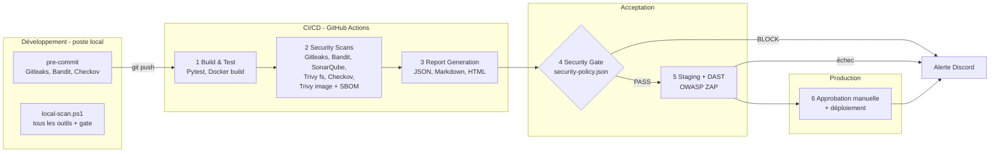

# 2. Architecture du pipeline

L'architecture suit quatre zones : **Développement** (sécurité *shift-left* sur le poste),
**CI/CD** (contrôles automatisés), **Acceptation** (Security Gate et staging) et
**Production** (déploiement après approbation). Chaque niveau du pipeline est un workflow
GitHub Actions réutilisable, enchaîné par l'orchestrateur
[`.github/workflows/devsecops.yml`](../../.github/workflows/devsecops.yml).

## 2.1 Vue d'ensemble

## 2.2 Niveaux du pipeline

| Niveau | Workflow | Outils | Exécution | Rôle |
|---|---|---|---|---|
| Développement | `.pre-commit-config.yaml`, `scripts/local-scan.ps1` | Gitleaks, Bandit, Checkov (+ tous les outils via Docker) | Poste du développeur | Bloquer un problème avant le commit |
| 1 Build & Test | `level1-build-test.yml` | Pytest + couverture, Docker | Runner GitHub | Tester, construire l'image **une seule fois** |
| 2 Security Scans | `level2-security-scans.yml` | Gitleaks, Bandit, SonarQube, Trivy fs, Checkov, Trivy image | Runner GitHub (+ poste pour SonarQube) | Analyser, en **mode rapport** (aucun scanner ne bloque ici) |
| 3 Report Generation | `level3-reports.yml` | `scripts/security_report.py` | Runner GitHub | Fusionner les rapports en un format commun |
| 4 Security Gate | `level4-security-gate.yml` | `scripts/security_gate.py` + `security-policy.json` | Runner GitHub | Décider **BLOCK** ou **PASS** |
| 5 Staging + DAST | `level5-staging-dast.yml` | Docker, OWASP ZAP | Poste (Docker Desktop) | Déployer en staging et attaquer l'application |
| 6 Approbation & déploiement | `level6-deploy-production.yml` | Docker | Poste (Docker Desktop) | Déployer en production après validation humaine |
| Alertes | `notify-discord.yml` | Webhook Discord | Runner GitHub | Prévenir en cas de blocage, d'échec ou de déploiement |

## 2.3 Outils par catégorie

| Catégorie | Outil | Ce qu'il analyse |
|---|---|---|
| Secrets | Gitleaks | Clés, tokens, mots de passe dans les fichiers |
| SAST | Bandit | Code Python |
| SAST + qualité | SonarQube | Vulnérabilités, bugs, couverture, Dockerfile |
| SCA | Trivy (filesystem) | CVE des dépendances (`requirements.txt`) |
| IaC | Checkov | `Dockerfile` et workflows GitHub Actions |
| Conteneur | Trivy (image) | CVE du système et des paquets de l'image |
| SBOM | Trivy (CycloneDX) | Inventaire des composants de l'image |
| DAST | OWASP ZAP (baseline) | Application en cours d'exécution, en staging |
| Conteneurisation | Docker / Docker Desktop | Build, staging, production |

**Rationalisation des outils.** Aucun outil n'a été ajouté quand un outil déjà présent
couvrait le besoin : le SBOM est produit par **Trivy** (Syft a été retiré) et **Checkov**
remplace Hadolint, car il couvre le Dockerfile **et** les workflows GitHub Actions.

## 2.4 Choix d'architecture

- **L'image est construite une seule fois** (niveau 1), puis scannée, déployée en staging
  et en production **sans être reconstruite** : ce qui est déployé est exactement ce qui a
  été analysé.
- **Les scanners ne décident pas, le Security Gate décide.** Au niveau 2, chaque outil
  produit son rapport sans faire échouer le pipeline. Le niveau 4 applique une politique
  unique et versionnée ([`security-policy.json`](../../security-policy.json)). Changer un
  seuil revient à modifier un fichier, relu dans une Pull Request.
- **Échec par défaut (*fail closed*).** Si un scanner plante ou ne s'exécute pas, son
  rapport manque et le Security Gate bloque.
- **Mêmes règles partout.** Les fichiers d'exemption (`bandit.yaml`, `.checkov.yaml`,
  `.trivyignore`, `.zap/rules.tsv`) sont lus par les scanners eux-mêmes, en local comme
  dans le pipeline. `scripts/local-scan.ps1` exécute aussi le même rapport et le même gate.
- **Les déploiements ne partent que de `main`.** Une Pull Request exécute les niveaux 1
  à 4, jamais le staging ni la production.
- **Une validation humaine avant la production.** L'environnement GitHub `production` a un
  relecteur obligatoire : le niveau 6 attend que quelqu'un consulte les résultats et
  clique sur *Approve*.
- **Principe du moindre privilège** : tous les workflows n'ont que `contents: read`.

## 2.5 Politique du Security Gate

| Outil | Bloque si… |
|---|---|
| Gitleaks | un secret est détecté |
| Bandit | une alerte MEDIUM ou HIGH non exemptée |
| SonarQube | le Quality Gate « DevSecOps » échoue |
| Trivy fs / Trivy image | une CVE **corrigeable** est HIGH/CRITICAL **ou** a un score CVSS ≥ 7,0 |
| Checkov | un contrôle IaC échoue (non exempté) |
| Tous | le rapport de l'outil est absent |

Le seuil CVSS complète la sévérité de l'éditeur : lors du test négatif sur la version
vulnérable, il a bloqué 5 CVE classées MEDIUM par l'éditeur mais notées 7,0 ou plus en
CVSS (Jinja2, Werkzeug).

## 2.6 Infrastructure : cloud GitHub et poste Docker Desktop

Les runners GitHub (`ubuntu-latest`) exécutent les niveaux 1 à 4. Le poste de l'équipe
est enregistré comme **runner auto-hébergé** (label `docker-desktop`) et exécute ce qui a
besoin de Docker Desktop : SonarQube (niveau 2), le staging (niveau 5) et la production
(niveau 6).

| Conteneur | Image | Port (poste uniquement) | Rôle |
|---|---|---|---|
| `sonarqube` + `sonarqube-db` | `sonarqube:community`, `postgres:16` | 127.0.0.1:9000 | Analyse SAST et tableau de bord ([`sonarqube/docker-compose.yml`](../../sonarqube/docker-compose.yml)) |
| `devsecops-staging` | image de l'application | 127.0.0.1:5001 | Environnement de staging, cible d'OWASP ZAP |
| `devsecops-production` | image de l'application | 127.0.0.1:8080 | Environnement de production |

Staging et production sont deux conteneurs séparés, sur deux réseaux Docker distincts,
avec deux volumes de données distincts. Ils sont lancés par
[`scripts/deploy.ps1`](../../scripts/deploy.ps1) avec un durcissement d'exécution :

| Mesure | Option Docker |
|---|---|
| Système de fichiers en lecture seule (seul `/data` est inscriptible) | `--read-only --tmpfs /tmp` |
| Aucune capacité Linux | `--cap-drop ALL` |
| Pas d'élévation de privilèges | `--security-opt no-new-privileges:true` |
| Limites de ressources | `--memory 256m --pids-limit 100` |
| Port accessible depuis le poste uniquement | `-p 127.0.0.1:<port>:5000` |
| Retour arrière automatique si le contrôle de santé échoue | conteneur précédent conservé puis restauré |

Le retour arrière a été testé : le déploiement d'une image défectueuse échoue au contrôle
de santé, et la version précédente est restaurée et répond de nouveau.

**Sécurité du runner auto-hébergé.** Le dépôt est public : un runner auto-hébergé
exécuterait le code de n'importe quelle Pull Request. Le job SonarQube est donc limité aux
`push` et aux PR internes, staging et production ne partent que de `main`, et
l'approbation des workflows des contributeurs externes est exigée dans les paramètres du
dépôt. Les secrets (`SONAR_TOKEN`, `PROD_SECRET_KEY`, `DISCORD_WEBHOOK_URL`) sont stockés
dans GitHub, jamais dans le code.

## 2.7 Rapports et alertes

| Artefact | Niveau | Contenu |
|---|---|---|
| `pytest-report` | 1 | Résultats des tests, couverture (réutilisée par SonarQube) |
| `app-image` | 1 | Image Docker construite (conservée 3 jours) |
| `scan-*` | 2 | Rapport brut de chaque scanner (JSON) |
| `sbom` | 2 | `sbom.cyclonedx.json` (Trivy) |
| `security-report` | 3 | `summary.json`, `security-report.md`, `security-report.html` |
| `gate-result` | 4 | Décision BLOCK/PASS et constats bloquants |
| `dast-zap-report` | 5 | `zap-report.html`, `zap-report.json` |

Le rapport consolidé et la décision du Security Gate s'affichent aussi dans le résumé
de l'exécution GitHub Actions. En cas de blocage, d'échec ou de déploiement, un message
est envoyé sur **Discord** avec le lien vers l'exécution.
